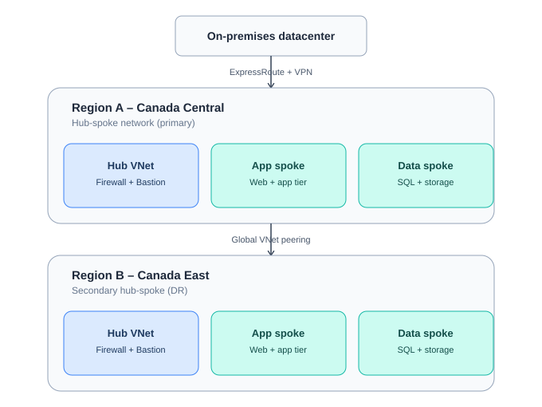

# Azure Hub-Spoke Network Architecture — Alex_Kayijamahe Ltd

A two-region Azure Virtual Network design built to migrate an on-premises datacenter
to Azure, with security, scalability, and cross-region connectivity as the primary
design goals.

## Architecture



- **Region A (Canada Central)** — primary hub-spoke, includes the on-premises VPN
  connection.
- **Region B (Canada East)** — secondary hub-spoke for DR, reachable from on-premises
  through Region A's gateway via Global VNet Peering.
- Each hub contains: Azure Firewall, Azure Bastion, (Region A only) a VPN Gateway.
- Each region has two spokes: an App tier and a Data tier, peered only to their
  region's hub — spoke-to-spoke traffic is forced through the firewall via route
  tables, never direct.

## Why this design

- **Security** — Azure Firewall inspects all east-west and north-south traffic;
  Bastion removes the need for public IPs on any VM; NSGs add a second filtering
  layer at the subnet level.
- **Scalability** — hub-spoke isolates workloads into their own VNets, so new
  spokes can be added without re-architecting the hub.
- **Connectivity** — ExpressRoute (or VPN as backup) links on-premises to Azure;
  Global VNet Peering links the two regions over Microsoft's private backbone.

## Repo contents

| File | Purpose |
|---|---|
| `Deploy-AKL-HubSpoke-Architecture.ps1` | Full PowerShell (Az module) script that deploys the entire architecture |
| `docs/troubleshooting-notes.md` | Real gotchas hit during manual Azure Portal deployment, and how they were resolved |
| `docs/architecture-diagram.svg` | Architecture diagram embedded above |
| `.gitignore` | Excludes OS/editor clutter and anything that could hold secrets |

## Prerequisites

- PowerShell 7+
- `Install-Module -Name Az -Scope CurrentUser -Repository PSGallery -Force`
- An Azure subscription with permission to create resource groups, networking,
  and gateway resources

## Deploying

```powershell
./Deploy-AKL-HubSpoke-Architecture.ps1
```

The script is heavily commented — each step explains what it's building and why.
Review the variables at the top (region names, address spaces, on-prem IP) before
running.

**Note:** the VPN Gateway step takes 30-45 minutes to provision. Azure Firewall
and Bastion typically take 5-10 minutes each. This is expected, not a stuck
deployment.

## Known limitations / next steps

- Firewall policy rules (allow/deny traffic) are not yet defined — the firewall
  resource exists but currently has no rules attached.
- NSGs are not yet applied to the spoke subnets.
- ExpressRoute is referenced in the design but not deployed — the circuit itself
  requires provisioning through a connectivity provider, outside what PowerShell
  or the Portal alone can complete.

## Author

Alex Kayijamahe — Cybersecurity Specialist, Ottawa, ON
Built as a hands-on lab toward Cloud Security Engineer roles.
